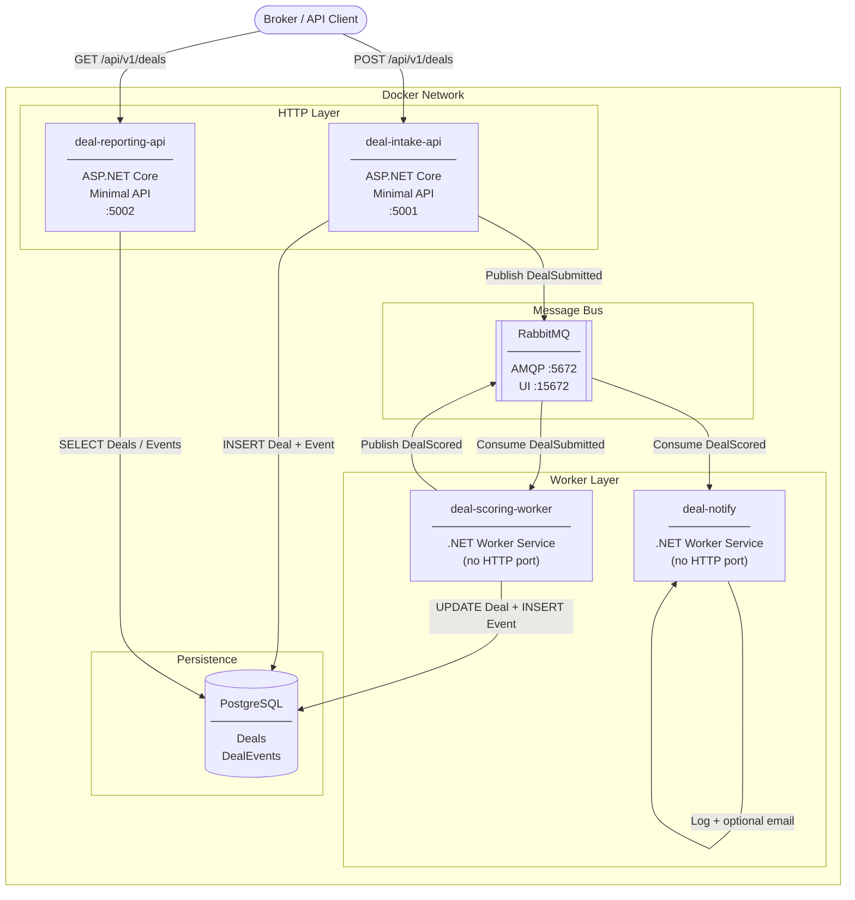
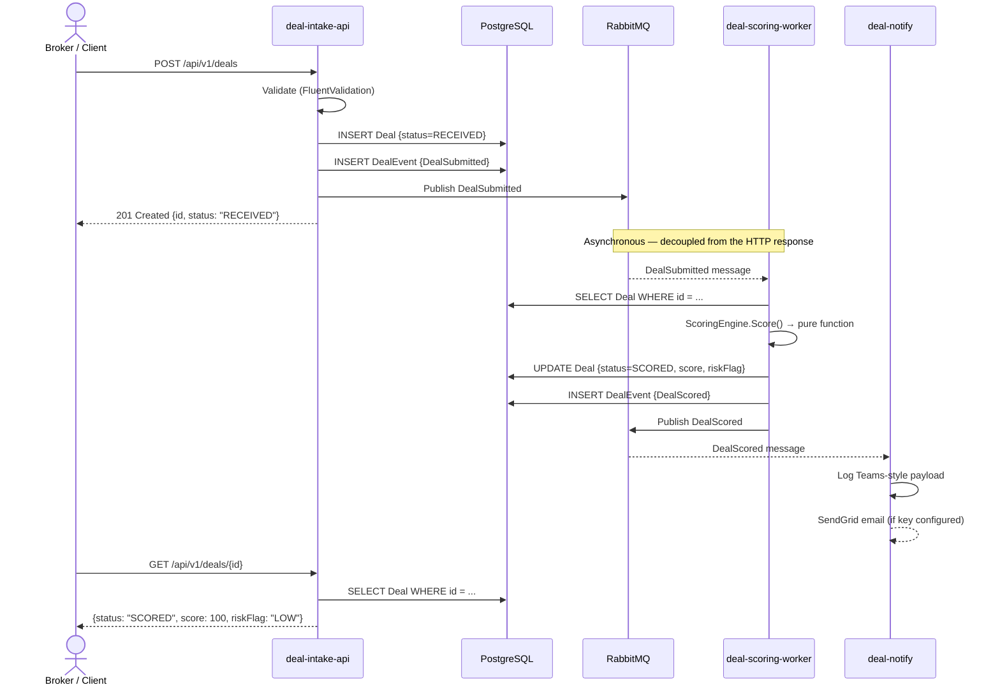
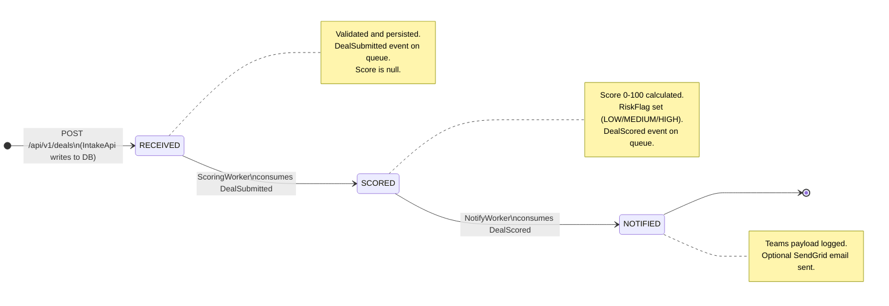
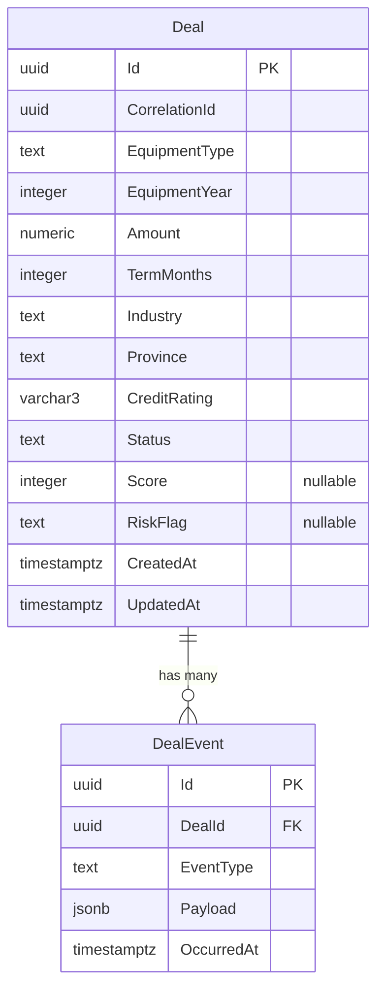
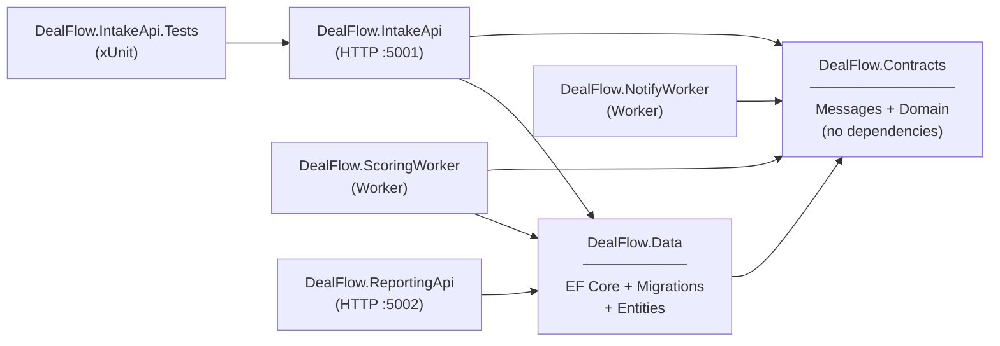

# DealFlow Sandbox

A microservices deal-pipeline built on **.NET 10**, demonstrating async event-driven architecture with message queues, worker services, a shared relational database, and a one-command local stack.

The system models a simplified equipment-financing workflow: a broker submits a deal, it is automatically risk-scored, and a notification is dispatched — all without the services calling each other directly.

---

## Architecture Overview



The key structural point: **no service calls another service over HTTP**. The only shared communication channels are Postgres (state) and RabbitMQ (events). This is the defining characteristic of an event-driven architecture.

---

## Event Flow (Happy Path)



The client's HTTP response at step 6 comes back immediately — before scoring has happened. The scoring happens in the background, decoupled. The client polls (or could use webhooks/websockets in a production system) to get the final result.

---

## Deal Status Lifecycle



Status is stored as a plain string column in Postgres (`RECEIVED`, `SCORED`, `NOTIFIED`). Each transition is written by the service responsible for that step — IntakeApi owns `RECEIVED`, ScoringWorker owns `SCORED`.

---

## Data Model



`DealEvent` is an append-only audit log. Every state change writes a row here with the full JSON payload of what happened. This is a lightweight form of the **Event Sourcing** pattern — the current state lives in `Deal`, but the full history lives in `DealEvents`. The reporting API exposes this as a timeline endpoint.

---

## Project Dependency Graph



`DealFlow.Contracts` has **no dependencies** — it is pure C# records. Any service that needs to produce or consume a message references it. This is the single source of truth for message shape. `DealFlow.Data` wraps EF Core and is referenced by any service that needs database access. `NotifyWorker` notably does **not** depend on `DealFlow.Data` — it only receives the scored values from the message and does not need to touch the database.

---

## Deployment Topology

```mermaid
graph TB
    subgraph local ["Local — Docker Compose (this repo)"]
        direction LR
        lPG[("postgres\ncontainer")]
        lMQ[["rabbitmq\ncontainer"]]
        lIA["intake-api\ncontainer :5001"]
        lSW["scoring-worker\ncontainer"]
        lNW["notify\ncontainer"]
        lRA["reporting-api\ncontainer :5002"]
    end

    subgraph azure ["Azure — Container Apps (docs/azure-setup.md)"]
        direction LR
        aPG[("Azure DB for\nPostgreSQL\n(managed)")]
        aMQ[["RabbitMQ\nContainer App\n(internal)")]
        aIA["deal-intake-api\nContainer App\n(external ingress)"]
        aSW["deal-scoring-worker\nContainer App\n(no ingress)"]
        aNW["deal-notify\nContainer App\n(no ingress)"]
        aRA["deal-reporting-api\nContainer App\n(external ingress)"]
        ACR(["Azure Container\nRegistry"])
        GHA(["GitHub Actions\nCI/CD"])
        GHA -->|"docker build + push"| ACR
        ACR -->|"pull image"| aIA
    end
```

The same Docker images run in both environments. The only difference is what `ConnectionStrings__DefaultConnection` and `RabbitMQ__Host` point to. Locally those values are hardcoded in `docker-compose.yml`. In Azure they come from Container App environment variables (no `.env` file anywhere).

---

## Design Decisions

These are the meaningful choices made and why — including honest acknowledgement of the trade-offs.

### 1. Async messaging over synchronous HTTP calls

The most important architectural choice. IntakeApi does not call ScoringWorker over HTTP. It publishes an event and forgets.

**Why:**
- **Resilience** — if ScoringWorker is down, the message sits in the queue and is processed when it comes back. With a direct HTTP call, IntakeApi would fail immediately.
- **Decoupling** — IntakeApi does not need to know ScoringWorker exists. Adding a new consumer (e.g. a fraud-check worker) requires zero changes to IntakeApi — you just subscribe a new service to the same event.
- **Backpressure** — RabbitMQ absorbs spikes. If 10,000 deals are submitted in a burst, they queue up and are processed at the rate ScoringWorker can handle them, rather than hammering ScoringWorker with 10,000 concurrent HTTP requests.

**Trade-off:** The system is eventually consistent, not immediately consistent. A client that reads the deal right after submitting will see `status=RECEIVED` with no score. This requires either polling, webhooks, or a push mechanism to get the final result — more complexity on the client side.

---

### 2. Shared DealFlow.Contracts library

Both IntakeApi (producer) and ScoringWorker (consumer) reference the same `DealSubmitted` C# record. The message contract is not duplicated.

**Why:** In a distributed system, message schema drift is a common failure mode. If the producer adds a field and the consumer does not know about it, you get silent data loss or deserialization errors at runtime. Sharing a contracts library keeps both sides in sync at compile time.

**Trade-off:** In a real multi-team environment, separate services would likely live in separate repositories and publish the contracts package to a NuGet feed rather than sharing a project reference. A project reference is appropriate for a monorepo or a small team.

---

### 3. Event log as an audit trail (DealEvents table)

Every state change writes a row to `DealEvents` with the full JSON payload of the event. The current state is in `Deal`; the history is in `DealEvents`.

**Why:** Financial systems need an audit trail. Without this, you know a deal was scored 72 but not _what inputs produced that score at what time_. The events table answers "what happened and when" without requiring full event sourcing.

**This is a pragmatic middle ground** between a mutable record ("just update the row") and full event sourcing ("the current state is derived from replaying all events"). You get the audit trail without the operational complexity of event sourcing.

---

### 4. Idempotent consumers

Both workers check whether a deal has already been processed before acting. If ScoringWorker scores a deal, writes to Postgres, but crashes before acknowledging the message to RabbitMQ, MassTransit will redeliver the message. The idempotency guard (`if deal.Status == Scored → skip`) ensures that redelivery is harmless.

```
MassTransit delivers message
    → Worker checks if already processed
    → If yes: log and return (no-op)
    → If no: process and save
```

**Why this matters:** In any distributed system, message delivery is *at-least-once*, not *exactly-once*. Building consumers that are safe to retry is not optional — it is a correctness requirement.

---

### 5. Shared database (acknowledged trade-off)

IntakeApi, ScoringWorker, and ReportingApi all connect to the same Postgres instance and share the same schema.

**Why accepted for this project:** The goal of this sandbox is to demonstrate the event-driven communication pattern clearly. Adding database-per-service would introduce API composition, CQRS projections, or a saga orchestrator — all valuable patterns, but ones that would obscure the core message-passing mechanics.

**What you'd change at scale:** In a production system with separate teams, each service would own its own database. ScoringWorker would not read the `Deal` entity directly — it would receive everything it needs in the `DealSubmitted` message payload and write results to its own store. ReportingApi would build a read-optimised projection from events rather than querying the source database.

---

### 6. ScoringEngine as a pure function

```csharp
public static (int Score, string RiskFlag) Score(DealSubmitted deal)
```

The scoring logic takes inputs and returns outputs. No database calls, no side effects, no dependencies.

**Why:** Pure functions are trivially testable (no mocks), inherently reusable, and easy to reason about. The scoring logic could be extracted to a NuGet package, evaluated in a browser via Blazor WASM, or used in a pre-scoring estimate endpoint — all without any changes to the function itself. Keeping I/O at the edges and logic pure is a habit worth building.

---

### 7. Minimal APIs over MVC Controllers

```csharp
app.MapPost("/api/v1/deals", async (SubmitDealRequest request, ...) => { ... });
```

No `[ApiController]`, no `[HttpPost]`, no separate controller class. Routes are functions.

**Why:** For services with a small, well-defined surface area, Minimal APIs reduce boilerplate without sacrificing anything meaningful. The endpoint is the unit of logic. This also happens to be the direction Microsoft is heading with ASP.NET Core — Minimal APIs are the primary model in .NET 8+.

**When to prefer MVC:** Large surfaces with shared filters, model binding customisation, or teams that have existing MVC conventions would be better served by controllers.

---

### 8. Worker Services with no HTTP port

ScoringWorker and NotifyWorker have no HTTP listener. They are not addressable over the network.

**Why:** A service that only receives work from a queue does not need an HTTP port. Exposing one would create a surface area to manage (auth, health checks, TLS) with no benefit. The `depends_on` in `docker-compose.yml` and the MassTransit connection retry handles startup ordering.

**What's added for observability:** In production these workers would expose a health check endpoint (or use the Azure Container Apps built-in health probe) so the platform can restart them if they become unresponsive.

---

### 9. Docker-first development

`docker compose up --build` is the only command needed to run the full system. No local Postgres installation, no local RabbitMQ, no SDK required on the host.

**Why:** The single biggest source of "works on my machine" problems is environment divergence. Docker Compose pins the exact versions of every dependency and wires them together identically for every developer. The same images that run locally are deployed to Azure.

---

## Scoring Logic

All deals start at **100 points**. Deductions for risk factors:

| Factor | Condition | Deduction |
|---|---|---|
| Deal size | Amount > $1,000,000 | −35 pts |
| Deal size | Amount > $500,000 | −20 pts |
| Term length | TermMonths > 60 | −10 pts |
| Equipment age | EquipmentYear < 2018 | −15 pts |
| Vendor quality | Tier B | −10 pts |
| Vendor quality | Tier C | −20 pts |

Score is clamped to [0, 100].

**Risk classification:**
- 75 – 100 → `LOW`
- 50 – 74 → `MEDIUM`
- 0 – 49 → `HIGH`

**Example — clean deal:** $250k · 36 months · 2022 equipment · Tier A = **100 (LOW)**
**Example — risky deal:** $800k · 72 months · 2016 equipment · Tier B = 100 − 20 − 10 − 15 − 10 = **45 (HIGH)**

---

## Quick Start

**Prerequisite:** Docker Desktop (running)

```bash
docker compose up --build
```

First run takes ~2 minutes (downloads images, compiles all .NET projects). Subsequent starts are fast via Docker layer caching.

| Endpoint | URL |
|---|---|
| Submit / query deals | http://localhost:5001 |
| Interactive API docs (IntakeApi) | http://localhost:5001/scalar/v1 |
| Reporting queries | http://localhost:5002 |
| Interactive API docs (ReportingApi) | http://localhost:5002/scalar/v1 |
| RabbitMQ Management UI | http://localhost:15672 — `guest` / `guest` |

---

## API Reference

### IntakeApi — `localhost:5001`

#### `POST /api/v1/deals`

Submit a new deal.

```json
{
  "equipmentType": "Semi-Truck (Kenworth T680)",
  "equipmentYear": 2023,
  "amount": 185000,
  "termMonths": 60,
  "industry": "Transportation",
  "province": "ON",
  "creditRating": "CR2"
}
```

Validation rules: `creditRating` must be CR1–CR5 (CR1 = best) · `amount` 1–10,000,000 · `termMonths` 6–120 · `equipmentYear` 1990–next year.

Returns `201 Created` with the deal record (`status: "RECEIVED"`, `score: null`).

#### `GET /api/v1/deals/{id}`

Returns the current state of a deal including score and risk flag once processed.

---

### ReportingApi — `localhost:5002`

#### `GET /api/v1/deals`

List all deals. Optional query parameters:

| Parameter | Example | Effect |
|---|---|---|
| `status` | `?status=SCORED` | Filter by status |
| `minAmount` | `?minAmount=500000` | Minimum deal value |
| `creditRating` | `?creditRating=CR5` | Filter by credit rating |

#### `GET /api/v1/deals/{id}/timeline`

Returns the ordered event log for a single deal:
```json
[
  { "eventType": "DealSubmitted", "payload": "...", "occurredAt": "..." },
  { "eventType": "DealScored",    "payload": "...", "occurredAt": "..." }
]
```

---

## Project Structure

```
DealFlow-Sandbox/
├── src/
│   ├── DealFlow.Contracts/          # Shared message contracts + domain constants
│   │   ├── Domain/                  # DealStatus, RiskFlag (string constants)
│   │   └── Messages/                # DealSubmitted, DealScored (C# records)
│   │
│   ├── DealFlow.Data/               # Shared EF Core layer
│   │   ├── Entities/                # Deal, DealEvent
│   │   ├── Migrations/              # EF-generated SQL migrations
│   │   └── DealFlowDbContext.cs     # Schema + relationships
│   │
│   ├── DealFlow.IntakeApi/          # HTTP API — port 5001
│   │   ├── Models/                  # SubmitDealRequest, DealResponse DTOs
│   │   ├── Validators/              # FluentValidation rules
│   │   └── Program.cs               # All routes (Minimal API)
│   │
│   ├── DealFlow.ScoringWorker/      # Background worker — no HTTP
│   │   ├── Consumers/               # DealSubmittedConsumer
│   │   └── Scoring/                 # ScoringEngine (pure function)
│   │
│   ├── DealFlow.NotifyWorker/       # Background worker — no HTTP
│   │   └── Consumers/               # DealScoredConsumer
│   │
│   ├── DealFlow.ReportingApi/       # HTTP API — port 5002
│   │   └── Program.cs               # List + timeline routes (Minimal API)
│   │
│   └── DealFlow.IntakeApi.Tests/    # xUnit integration tests
│
├── docs/
│   ├── azure-setup.md               # Full Azure Container Apps deployment guide
│   └── demo.md                      # Curl-based walkthrough script
│
├── .github/workflows/ci.yml         # GitHub Actions: build + test on push
├── docker-compose.yml               # Full local stack definition
└── DealFlow.slnx                    # .NET 10 solution file
```

---

## How Local Infrastructure Works

Every dependency runs as a Docker container. There is nothing to install locally except Docker Desktop.

| Container | Image | What it does |
|---|---|---|
| `postgres` | postgres:16-alpine | Relational database. Tables auto-created by EF Core on first start. |
| `rabbitmq` | rabbitmq:3.13-management-alpine | Message broker. Queues auto-created by MassTransit on connect. |
| `deal-intake-api` | Built from source | ASP.NET Core on internal port 8080, mapped to host 5001. |
| `deal-scoring-worker` | Built from source | Worker service. No port. Connects to RabbitMQ + Postgres. |
| `deal-notify` | Built from source | Worker service. No port. Connects to RabbitMQ only. |
| `deal-reporting-api` | Built from source | ASP.NET Core on internal port 8080, mapped to host 5002. |

**Service discovery:** Docker creates a private bridge network. Each service is reachable by its `docker-compose.yml` name (`postgres`, `rabbitmq`, etc.). The connection string `Host=postgres;...` resolves to the Postgres container IP automatically. This hostname only exists inside Docker — it is not accessible from outside.

**Startup order:** `depends_on` with `condition: service_healthy` ensures the .NET services wait for Postgres and RabbitMQ to pass their health checks before starting.

**Database persistence:** Postgres data is stored in the `postgres_data` Docker volume. `docker compose down` keeps it. `docker compose down -v` wipes it.

**Credentials:** All credentials in `docker-compose.yml` are intentional dev-only throw-aways. In production, these come from Azure Key Vault or Container App secrets — not from source control.

---

## Running the Tests

```bash
dotnet test DealFlow.slnx
```

The integration test project (`DealFlow.IntakeApi.Tests`) uses `WebApplicationFactory<Program>` to boot a real instance of IntakeApi in-process. No Docker required. Tests exercise the full HTTP → validation → database pipeline against an in-memory test database.

---

## Optional: Email via SendGrid

NotifyWorker always logs a Teams-style JSON payload to the console. To also dispatch a real email:

```bash
SENDGRID_API_KEY=your_key docker compose up
```

If the variable is absent, the email step is silently skipped.

---

## Cloud Deployment (Azure)

When you are ready to move beyond local:

| Local | Azure equivalent |
|---|---|
| `postgres` container | Azure Database for PostgreSQL Flexible Server |
| `rabbitmq` container | RabbitMQ Container App (internal ingress) |
| Service containers | Azure Container Apps |
| Manual `docker build` | GitHub Actions pushes to Azure Container Registry |

The same Docker images are used in both environments. Environment-specific config (connection strings, RabbitMQ hostname) comes from Container App environment variables — not from the image.

See **[docs/azure-setup.md](docs/azure-setup.md)** for the full provisioning script.

**Prerequisites before deploying:**
1. Free Azure account — https://azure.microsoft.com/free
2. `brew install azure-cli && az login`
3. Three GitHub Secrets: `ACR_LOGIN_SERVER`, `ACR_USERNAME`, `ACR_PASSWORD`

---

## What Would Change at Production Scale

This sandbox makes deliberate simplifications. A real production version would differ in these ways:

| This sandbox | Production consideration |
|---|---|
| Shared Postgres database | Database-per-service; each service owns its schema |
| Project reference to Contracts | NuGet package published to a private feed; independently versioned |
| Credentials in `docker-compose.yml` | Azure Key Vault; no secrets in source |
| Scoring logic in the worker | Separate scoring service or model-serving API; independently deployable |
| Polling for deal status | Webhook / SignalR push from NotifyWorker when pipeline completes |
| Single `postgres` migration runner | Schema migration as a separate init container or deploy step |
| No distributed tracing | OpenTelemetry traces across all services (correlation IDs are already plumbed) |
| NotifyWorker doesn't update DB | Would update `Deal.Status = NOTIFIED` and push to a webhook registry |

Correlation IDs (`CorrelationId` on every deal and event) are already in place — the groundwork for distributed tracing is there.

---

## Useful Commands

```bash
# Start the full stack (rebuilds changed images)
docker compose up --build

# Start in background
docker compose up -d --build

# Tail logs for one service
docker compose logs deal-scoring-worker -f

# Stop (data preserved)
docker compose down

# Stop and wipe the database
docker compose down -v

# Check container health
docker compose ps

# psql shell directly into the database
docker exec -it deal-flow-sandbox-postgres-1 psql -U dealflow -d dealflow

# Query deals directly in SQL
# \dt                      → list tables
# SELECT * FROM "Deals";   → all deals
# SELECT * FROM "DealEvents" ORDER BY "OccurredAt"; → full audit log
```

---

## Stack

| Layer | Technology | Version |
|---|---|---|
| Language | C# | 14 |
| Runtime | .NET | 10 |
| HTTP framework | ASP.NET Core Minimal APIs | 10 |
| Messaging | MassTransit + RabbitMQ | 8.5.8 |
| ORM | Entity Framework Core + Npgsql | 10 |
| Database | PostgreSQL | 16 |
| Validation | FluentValidation | 11 |
| Logging | Serilog | 10 |
| API Docs | Scalar (native .NET 10 OpenAPI) | 2.x |
| Containers | Docker + Docker Compose | — |
| CI | GitHub Actions | — |
| Cloud target | Azure Container Apps | — |
