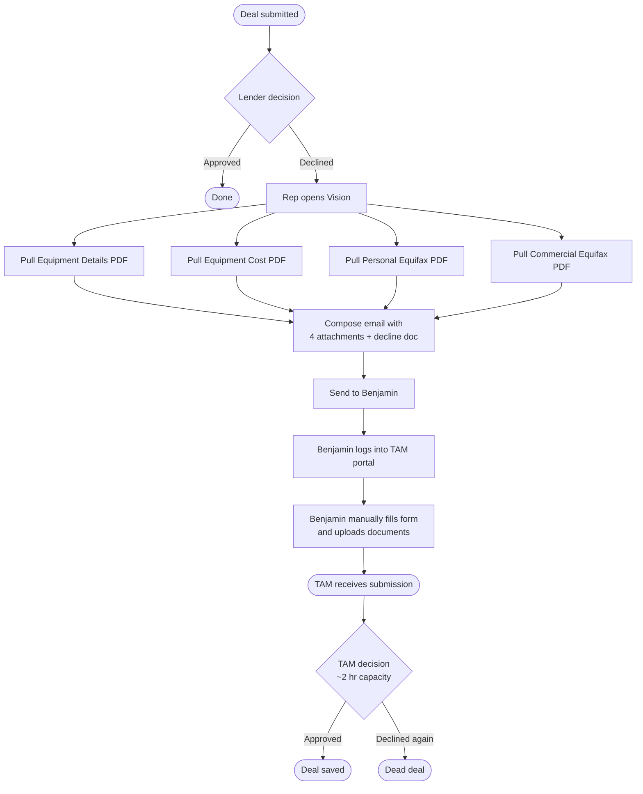
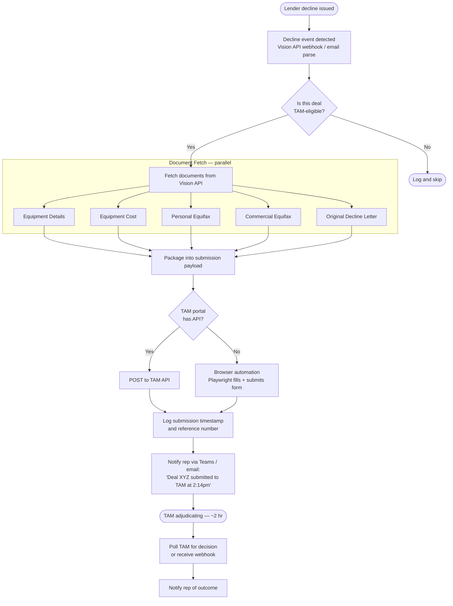

# Automation Ideas — Operations & Deal Pipeline

> Written from the field. The goal of this document is to capture what is actually slowing us down day to day, quantify it honestly, and outline where software can absorb the manual work so people can focus on selling and closing.

---

## The Problem, Quantified

Today was an 11-hour day. A significant portion of that time was not selling — it was paperwork that a computer could do.

The TAM resubmission process alone:

| Step | Time per deal |
|---|---|
| Pull equipment details from Vision | ~3 min |
| Pull equipment cost document | ~3 min |
| Pull personal Equifax | ~4 min |
| Pull commercial Equifax | ~4 min |
| Compose email to Benjamin with all attachments | ~6 min |
| Benjamin reviews and submits to TAM portal | ~5 min |
| **Total per deal** | **~25 minutes** |

On a day with 10+ declines, that is **4+ hours of administrative work** — more than half a regular workday — that produces zero revenue and zero client contact.

TAM told us in our last meeting they have **2-hour turnaround capacity**. That means the bottleneck is entirely on our end. Every hour we spend assembling documents is an hour TAM is not adjudicating. We are leaving same-day decisions on the table because of a process that has no reason to be manual.

---

## Current State — The As-Is Process



Every box between the lender decision and "TAM receives submission" is manual, repetitive, and identical every single time. It is a perfect candidate for automation.

---

## Proposed Solution — Automated TAM Resubmission Pipeline

The vision: a decline from any lender triggers an automated pipeline that gathers all required documents, packages them, and submits to TAM without a human touching it. The rep is notified when it is done.



**End state:** Rep submits a deal. It gets declined. Within 5 minutes it is in TAM's queue with no human involvement. The rep gets a Teams message: *"Deal for Acme Corp submitted to TAM at 2:14pm. Reference #TAM-8821."*

---

## Technical Architecture

### Trigger Layer — How We Know a Decline Happened

Two options depending on what access we have:

**Option A — Vision API (preferred)**
If Vision exposes a webhook or polling endpoint, we subscribe to deal status change events. When `status = DECLINED` and `lender != TAM`, the pipeline fires.

**Option B — Email parsing**
Decline notifications typically come by email. A service monitors a dedicated mailbox (e.g. `declines@company.com`), parses the email for deal ID, applicant name, and lender, and triggers the pipeline from there. Libraries like Microsoft Graph API make reading an Outlook mailbox straightforward.

---

### Document Fetch Layer — Vision API

Vision likely exposes document endpoints. The pipeline calls them in parallel (all 4 documents at once, not sequentially):

```
GET /api/deals/{id}/documents/equipment-details   → PDF
GET /api/deals/{id}/documents/equipment-cost      → PDF
GET /api/deals/{id}/equifax/personal              → PDF
GET /api/deals/{id}/equifax/commercial            → PDF
```

If Vision does not have a documented API, there are two fallback approaches:
1. **Screen scraping with Playwright** — automate a logged-in browser session that navigates Vision and downloads the documents the same way a human would
2. **Ask Vision's vendor for API access** — most modern origination platforms have APIs; we may just not have credentials yet

---

### Submission Layer — TAM Portal

**If TAM has an API:** A single authenticated HTTP POST with the documents attached as multipart form data. Fast, reliable, no UI dependency.

**If TAM does not have an API (browser automation):** Playwright drives a headless Chromium browser that logs into the TAM portal and fills the submission form programmatically. This is exactly how the DealFlow sandbox's service containers work — the same pattern applies here at the browser level.

Playwright can:
- Log in to TAM with stored credentials
- Navigate to the submission form
- Fill each field from the deal record
- Attach each PDF
- Click submit
- Scrape the confirmation / reference number

This is more fragile than an API (portal UI changes can break it) but it works and can be built quickly.

---

### Notification Layer

When the submission completes, the rep who owns the deal receives:
- A Teams message (via Teams webhook — requires no IT setup)
- Or an email with the submission reference number and timestamp

When TAM makes a decision (polled or webhook), the rep receives:
- Outcome notification
- If approved: next steps prompt (generate documents?)
- If declined: dead deal notification so they stop following up on it

---

### Infrastructure

This does not need to be complex. It is a small event-driven pipeline — the same architecture pattern as the DealFlow sandbox in this repository:

| Component | Local | Production |
|---|---|---|
| Trigger listener | Console app / Azure Function | Azure Function (event-driven, costs near zero) |
| Document fetcher | HTTP client | Same, runs inside the Function |
| TAM submitter | Playwright headless | Azure Container Instance (Playwright needs a browser runtime) |
| Notifications | Teams webhook POST | Same |
| State tracking | SQLite / Postgres | Azure Database for PostgreSQL |
| Secrets | `.env` file | Azure Key Vault |

Estimated monthly Azure cost for this at our volume: **under $30**.

---

## Broader Automation Opportunities

The TAM resubmission is the highest-urgency item because the time loss is most visible. But it is one of several places where manual process is the bottleneck.

---

### Follow-Up Automation

**The problem:** Deals sit at lenders with no response. Reps manually remember to follow up. Some deals fall through the cracks. Some reps are more diligent than others, which creates inconsistency in pipeline velocity.

**The solution:**
```
Deal submitted → start timer
  48 hours with no response → auto-send follow-up email to lender
  96 hours with no response → escalation email + rep notification
  7 days with no response → rep prompted to call + deal flagged in dashboard
```

This does not require lender cooperation. The follow-up emails go out whether the lender has read the first one or not. The discipline is systemic, not dependent on individual rep memory.

---

### Application Pre-Screening Before Submission

**The problem:** Some deals get declined for reasons that could have been caught before submission — equipment age, deal size outside an appetite, credit tier mismatch. Each declined deal that resubmits to TAM costs 25 minutes of admin time. Catching it before submission eliminates the admin work entirely.

**The solution:** Before submitting to any lender, run the deal through a rules engine that knows each lender's published appetite:

```
Equipment year < 2015 + Lender A → warn: "Lender A typically declines pre-2015 equipment"
Amount > $500k + Tier C vendor → warn: "Only 2 of your lenders accept this profile"
Province = QC + certain lenders → flag: "These lenders do not operate in QC"
```

This is not about blocking submissions — it is about giving the rep information before they hit send. One extra minute of pre-screening can save 25 minutes of post-decline administration.

---

### POA (Power of Attorney) Document Automation

**The problem:** Approved deals require a POA document to be generated, sent to the client, signed, and returned before funding. This involves:
1. Generating the POA with the deal's specifics
2. Emailing it to the correct signatory
3. Tracking whether it has been signed
4. Following up if it has not
5. Routing the signed copy to funding

Every step except the client's signature is currently manual.

**The solution:**
- **Document generation:** Template-based POA generation. Deal fields (names, equipment, amounts, terms) populate the template automatically. No copy-paste, no wrong names in documents.
- **eSignature dispatch:** DocuSign or Adobe Sign APIs send the envelope to the client the moment the deal is approved. No rep action required.
- **Status tracking:** The eSign platform webhooks back when the document is opened, signed, or has sat unsigned for X hours. Automated reminders go to the client. Rep is only notified when action is required from them.
- **Routing on completion:** Signed POA automatically attached to the deal record in Vision and a funding packet email triggered to the relevant party.

Time savings per funded deal: **30–45 minutes** of tracking and document handling eliminated.

---

### Funding Checklist Automation

**The problem:** Every funded deal requires the same checklist of documents before funds are released. Reps chase clients for the same items — invoice, insurance certificate, void cheque — on every single deal.

**The solution:** When a deal is approved, an automated email goes to the client immediately with a branded portal link or simple email template listing exactly what is needed. As each document is received, the checklist updates. When the checklist is complete, the rep is notified and the funding package is triggered. The client gets a reminder every 24 hours until complete.

This also removes the emotional friction of the rep having to "chase" clients — the system does it without it feeling personal.

---

### Pipeline Dashboard

**The problem:** At any given moment, a manager cannot quickly answer: how many deals are pending? How many are sitting at lenders with no response past 48 hours? How many declines happened today that have not been resubmitted to TAM?

**The solution:** A read-only dashboard (exactly like the `deal-reporting-api` in this repository, but pointed at real data) that shows:

- **Pipeline health:** Deals by status, by rep, by lender
- **Aging report:** How long each deal has been at each stage
- **TAM queue:** Declines waiting for resubmission, submitted, pending TAM decision
- **Follow-up alerts:** Deals past SLA at any lender
- **Conversion metrics:** Approval rate by lender, by equipment type, by deal size

This costs nothing to build once the data is flowing. It answers the questions that currently require someone to manually pull a report.

---

## Implementation Priority

| Priority | Item | Effort | Daily time saved |
|---|---|---|---|
| 1 | TAM resubmission automation | Medium | 2–4 hours on busy days |
| 2 | Automated lender follow-ups | Low | 30–60 min |
| 3 | POA generation + eSign dispatch | Medium | 30–45 min per funded deal |
| 4 | Funding checklist portal | Medium | 20–30 min per funded deal |
| 5 | Application pre-screening rules | Low | Prevents wasted submissions |
| 6 | Pipeline dashboard | Low | Eliminates manual reporting |

---

## What We Need to Move Forward

1. **Vision API credentials or documentation** — to know whether we pull documents programmatically or via browser automation
2. **TAM portal access** — either an API key or a test login to prototype the Playwright automation against
3. **A mailbox** we can monitor for decline notifications (if the Vision API route is not available as a trigger)
4. **Teams webhook URL** for the notification layer
5. **A conversation with IT/management** about what access can be granted — most of this is already possible, it just needs authorization

The TAM resubmission alone is worth building immediately. It is well-defined, the inputs are always the same, the output is always the same, and it is costing us hours every day. That is the definition of a process that should not be manual.

---

## Who Is Proposing This

I want to be straightforward: I am not claiming to be a .NET expert. The DealFlow sandbox in this repository is evidence that I can learn and apply a stack quickly, not a claim that I have been writing C# for a decade.

What I do bring:

**Technical background**
- Several years of programming experience across multiple languages and paradigms
- Almost two years of co-op experience working on real production systems
- Hands-on experience with microservices architecture, Docker, cloud infrastructure, and Linux — the full stack that anything built here would run on
- Currently completing a **Master's degree focused on distributed systems and machine learning** — the two technical areas most directly applicable to what is being proposed here. Distributed systems covers everything from how services communicate reliably to how you design for failure. Machine learning covers the scoring and prediction models that would make pre-screening and pipeline forecasting possible.
- Completed **CAS 735 — Microservices-Oriented Architecture** at the graduate level, receiving an A+. This is a rigorous course that covers the exact patterns used in the DealFlow sandbox: event-driven design, service decomposition, resilience patterns, and distributed systems trade-offs. The course is not introductory.

**Field background**
- I have been in sales. I know what a bad day of admin looks like from the inside — not from a requirements document.
- The automation ideas in this document were not generated by studying industry whitepapers. They come from watching deals stall, sitting on hold with lenders, and spending evenings on follow-ups that should have been handled at 9am.

That combination — knowing what hurts operationally and knowing how to build the thing that fixes it — is not common, and it is what makes these proposals actionable rather than theoretical.

**References available**
If the technical credibility needs independent verification, I can obtain letters of recommendation from two people I am fortunate to have worked with:

- **Dr. Mosser** — professor of the CAS 735 graduate microservices course. Can speak to the depth of the technical work and my approach to system design.
- **Dr. William Farmer** — my graduate supervisor, a highly respected computer scientist and logician whose work sits at the intersection of formal logic and computing. Can speak to my capacity for rigorous, systematic thinking and my ability to take on complex, open-ended problems independently.

I am not leading with credentials because credentials are not the point. The point is that there are hours leaving the building every day that do not need to. I know what to build. I know how to build it. I am asking for the access to do it.

If there is any doubt about the technical depth, I am completely open to a LeetCode-style assessment or a systems design interview — whatever the team uses to evaluate engineering ability. I would welcome it. I would also genuinely love to hear what projects the team is currently working on. I am sure there are problems being solved that I have not seen from my position, and the best way to be useful is to understand the full picture.

**A note on how this came together**

Nick C from IT is the one who put my name forward to Priyanka. When Priyanka reached out and mentioned the team was looking for a developer, I did not send a resume. I built this instead. The DealFlow sandbox in this repository is a working microservices system built specifically to demonstrate competence in the technologies she mentioned and to give myself a hands-on refresher on the stack. It is not a polished portfolio piece I had sitting around — it was built for this conversation.

For character references within the company: I am very confident that Siraaj Grewal (my current manager) and my account managers — Elizabeth Wylie, Edwin Van Schepen, and Matthew Gallo — would all speak to who I am and how I work. These are the people I operate with every day. They have seen firsthand how I approach problems, handle pressure, and show up for the team.

This is the opportunity I have been waiting for. I am already here. I already understand the business, the pain points, and the clients. I have the technical background to build the tools that would make this operation faster and more capable. I am asking for the chance to prove it properly.

---

> *The bottleneck is on our end. TAM is ready. The documents exist. The only thing between a declined deal and a TAM submission is a human doing a task a computer does better.*
